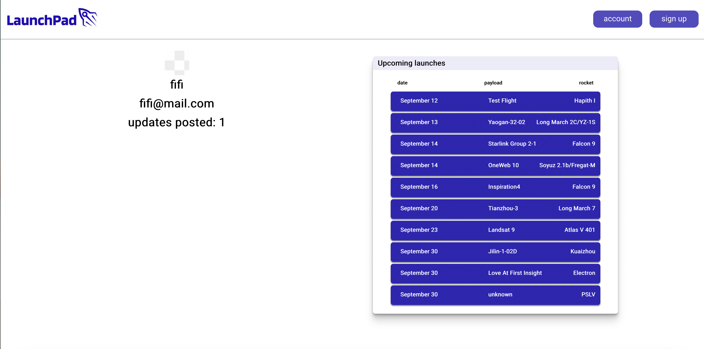

Project Four - Launch Pad

Overview: LaunchPad is a week-long individual project that uses Django, Postgres and React to create a responsive web page which provides users with upcoming rocket launches. It utilises a user governed update system, so the most reliable updates can be displayed depending on their votes.

Getting Started:

To experience the site it is currently deployed with heroku at [https://rocket-launch-pad.netlify.app/](https://rocket-launch-pad.netlify.app/) . Otherwise if you wish to edit and improve or simply play around with the code, simply fork it to your GitHub repository and run the server and client on your local machine. 

Brief:

Based on my passion for space and the current drive in space based innovation, I wanted to create a web-app that could provide information about upcoming launches. As the space launch community is very involved and generates a lot of open source information, I decided to include an update feature where users can leave updates for a particular launch. These updates can be voted on by any user to verify the reliability or unreliability of the information. This form of peer-reviewing allows the updates to be displayed in order of either popularity or reliability. 

The ability to register as a user is an essential component of the app. This adds the ability for users to be able to follow certain launches and receive updates and current information on their dashboard. It also allows them to be involved in the company through updates and comments.

The front end of the app was required to be built in React for its Hook State features. The backend was built with Django as it provided an out-of-the-box solution for quickly building user entities and instances of rocket launches. Using Django Rest Framework to create a REST API which can be utilised by the front end.  

Technologies Used:

    React.js
    Django
    Django Rest Framework
    Python
    Node.js
    PostgreSQL
    Apis:
    Thespacedevs.com - launch library
    OpenWeatherMap
    Packages (npm):
    React-twitter-embed 
    React-countdown 	

Process: 

1. Planning 

  As I was working with PostgreSQL, as opposed to the non-relational MongoDB, understanding the relationship of join tables was important. Using QuickDBD I constructed an initial plan of the database layout. I also drew a wireframe to illustrate how the information constructed in the backend is used in the front end and how it is displayed by the react components.

2. Backend

  Creating the models was the first thing to address. This involved defining what criteria is required for the launch and the update. For launch specific information such as the launch date and payload, using a specific charfield was enough. However I needed to be able to create a Joined table which took the launch Id and the user id to show who is following which launch. For this I used a ManyToMany field. This ‘join’ relation is created by defining the model it is referring to and the relational name to that model.

  I repeated this technique with the updates as it uses a manyToMany fields to collate the user ids from the voting system.

  The user Simply required the addition of an email and an avatar as the abstract user preset already contained the necessary user login info such as username and password with password confirmation.

  Serialisers allow the data being passed as an object to be formatted into common data types ie. JSON. The launch serializers were required to nest the user details within the update and the update within the launch instance. To do this I referred to each serializer within its parent instance.

  Within the user serializer, all of the information provided is serialized as normal apart from the password. As the password needs to be confirmed to match as well as being hashed for security, I used a custom validate function.

  The last non-standard component to create is the JSON Web Token authentication. By using the def authenticate function I created a custom authentication. Upon receiving the request the function will check for the header and upon confirmation will check the web token, and as a result return the authed user and the token.

  I then constructed the views to create the CRUD functionality of the user and the launch instances. This will allow the front end to create accounts and launches as well as deleting and editing them based on the declared authorization type.

  To seed the database with initial data I created a Python file that calls the launch library api then formats the information into the launch model format. 

3. Frontend:

  Following testing of my API endpoints, I decided to start building the site from the most basic functionality. I created a library of all the CRUD requests I will need. I also created a function library of local storage access for setting and getting headers as well as a function for checking whether the token is matched with the user instance.

  The next step was to construct the necessary components for user interaction. This means creating a sign up page, a sign in page and a user dashboard where users will be able to log-out and edit their profile. By using a handle change on the sign up and sign in form I can store the input data in a UseState. When the submit is called it refers to the correct axios request while sending the form data. For when the submission is successful, I used a history.push method to route the user back to the home page or user dashboard. 

  My next priority was to start populating a list with the seeded data. I used a map method to create multiple instances of a clickable tab which contains only the essential details such as launch date, payload and launch vehicle. Each tab would redirect via the browser router to an individual launch page. To display each launch I created a component that would house the update, update create and the more detailed launch information tab. 

  As I wanted to display relevant data for the launch I used the openweather api to display icons depending on the api request weather description. Using the url parameters, a useEffect function called for the correct launch, it then separated the weather data from the response and used lon lat to make an api call to retrieve a 5 day forecast. It checks the launch day and determines whether the date in the forecast contains the launch day. If it did, it displayed the weather for that day, otherwise it showed the weather currently at the launch site. It also used the datetime to activate a countdown timer.

  The Twitter feed used an npm package which accepted either tags or account names. As finding the account name for a particular launch provider would have been difficult without the exact account name, I populated the list with all major launch providers and the corresponding name provided by the launch api. The Twitter feed would then access this variable and set the twitter handle to the correct launch provider. 

  To create an update I used a form to enter the information required to create an update instance. The form was populated via object spreading and the form input. I implemented radio buttons to specify the type of update, the handle function then checked to see which one was selected and spread the current information along with the user choice to the form data.

  When displaying the update instance, the information was displayed using JSX with string formatting using states. Upon populating the list of updates the instance of the update checks to see whether a vote has been made by the currently logged in user. The function then applies a class depending on whether the user can make a verification by either greying-out or coloring in the button. 

  The update show component lists the updates which are listed depending on the time they are posted, the amount of votes and which are the most reliable updates. I used a function to analyse the update info and push to lists in order of relevancy depending on each filter property. The lists are then populated using the created arrays of updates.

Known Errors/Bugs:

When a verify button is clicked, the rest of the buttons turn grey to indicate that the user can only make a single vote. On occasion the button does not trigger this change in the other buttons. Further analysis of the code may lead to a solution but currently it is not evident what is causing the bug.

Challenges:

The initial challenge was adapting to the serializers combined with the model views. Understanding the syntax and adapting the out-of-the-box solutions to a more custom solution was quite difficult as the Django rest framework and Django had presets which were similar but with nuanced differences.

On the client side, I ran into a particular problem with the backend request which dealt with the voting function. The solution was a bug within axios itself, which was resolved by changing the format of the request to be more specific about its input format. This was the first package bug I had come across so being able to trace the errors back to axios itself was challenging.

Wins:

One of my aims was to create a dashboard style information page that was populated by multiple different components. I ran into problems because of the asynchronous delay in getting the launch information to the components. This initially resulted in 404 responses before being successfully populated or lost information which could not be referred to by the component functions. However my ability to utilise the hooks and useEffect dependencies allowed me to create a work around. 

I decided not to use premade UI elements such as buttons and cards. I focused on using raw CSS to reinforce my core css understanding. I feel I have been able to create a consistent and clear UI that can be replicated for similar component instances. 

Future Improvements:

Currently, the initial data is seeded manually through the Django server and is essentially static and does not update when a new launch is added to the Launch Library API. Having a backend function which intermittently refers to the Launch Library API would allow the app to assess whether there was a launch not currently in the web app library. If this was the case it could create a new entity. As well as this if there was a launch with updated information, it would be able to make the necessary changes without having to destroy then recreate the instance which would result in the linked user updates being also destroyed.

The use of a 3D web render package such as Three.js has the potential to add an interactive visual element. Being able to visualize the particular launch vehicle and payload could provide a learning feature for the younger generation just getting involved in space technologies. In addition, it could attract 3D modelers to submit 3D models for use on the app.

Key Learnings:

Understanding of the Django framework, especially in how its MVT works. The serializer and model format is a departure from the MongoDB NoSQL format as used in previous projects. Its standard User form models became very useful in this project's use case. 

The referencing and linking between different datasets through the use of foreign keys and nested serializers aided in compartmentalising certain data easily. 

Furthering knowledge of the utility of React Hooks and passing props between components.